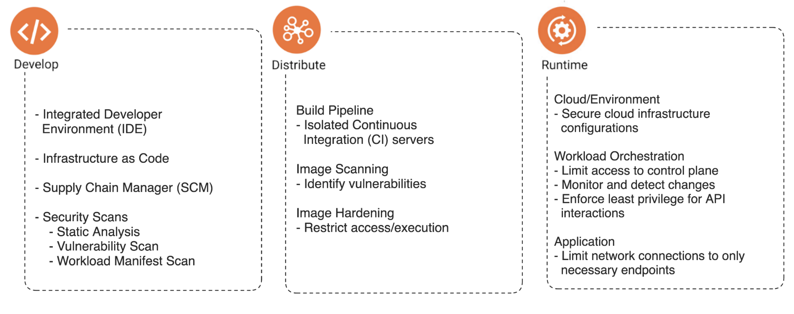
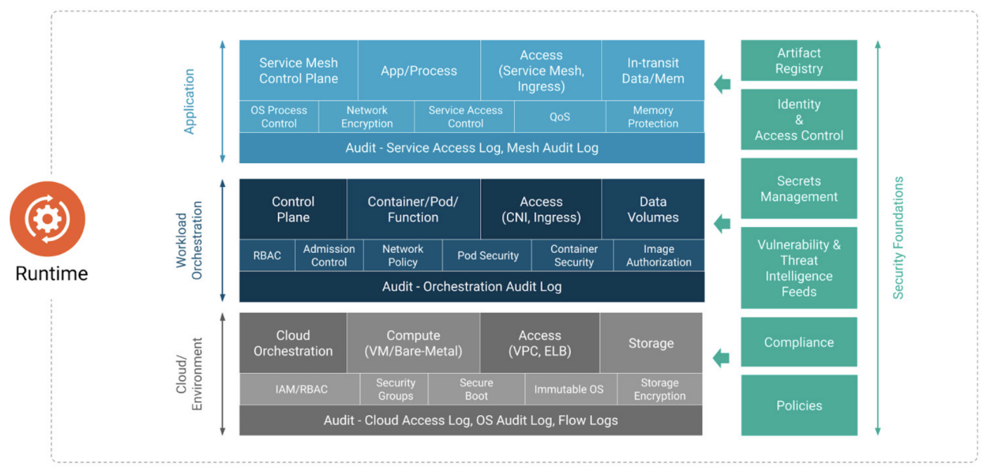
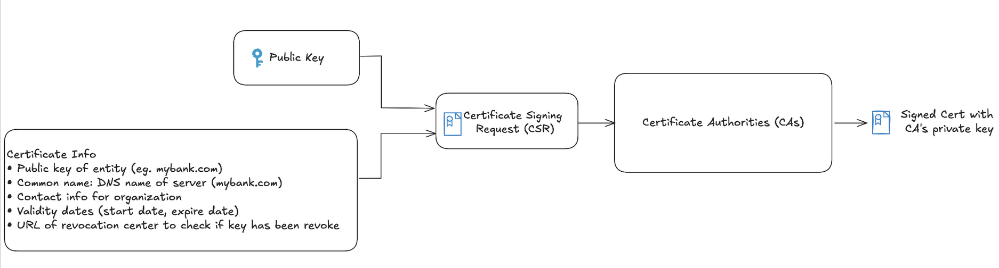
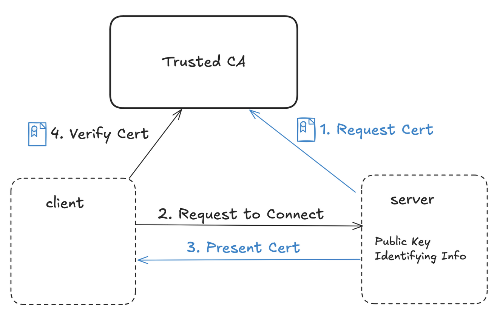
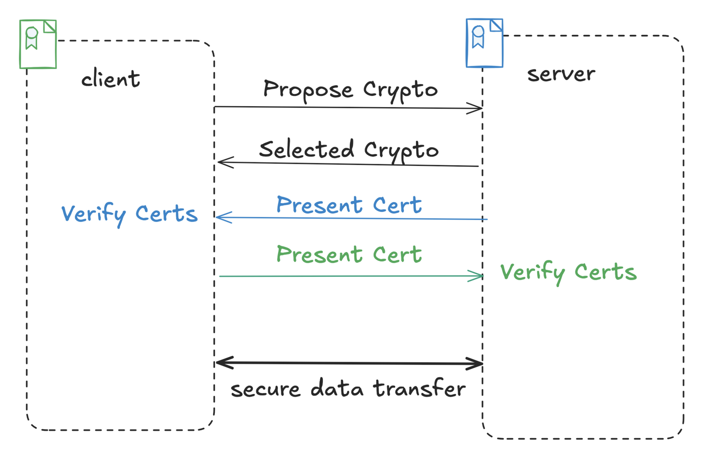
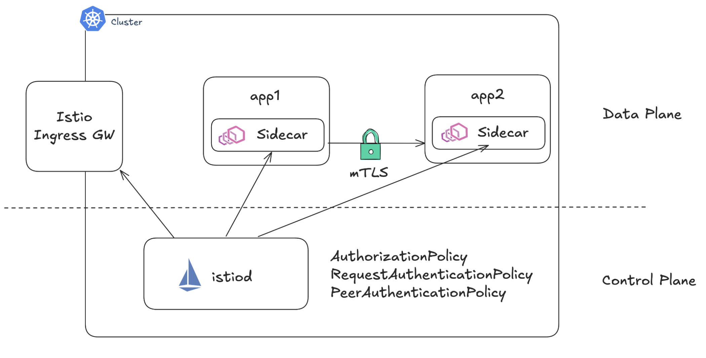
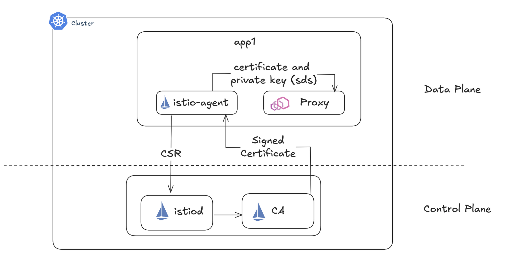
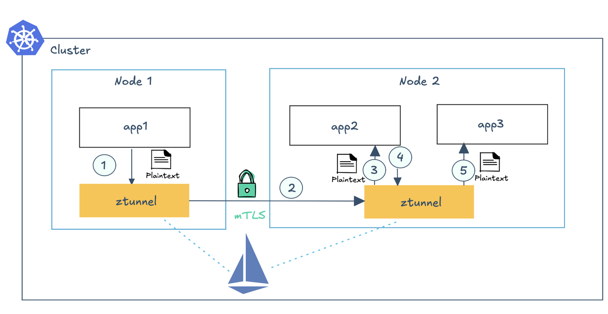
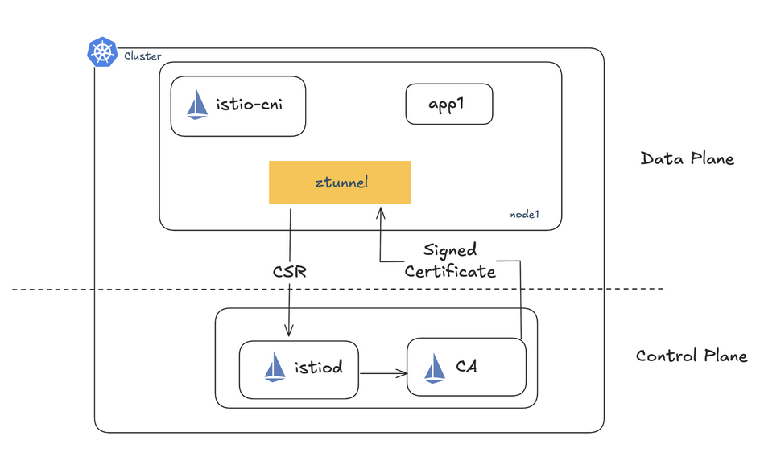
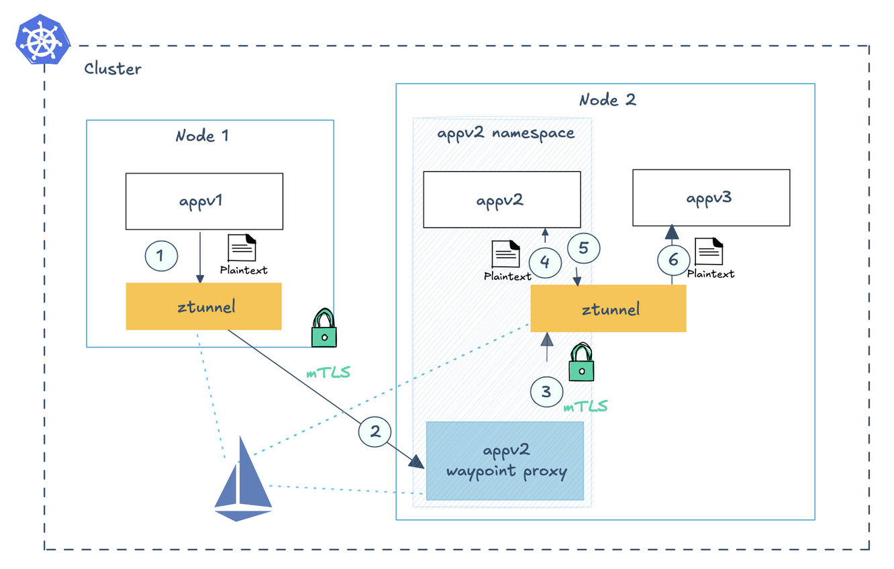

# Demystifying Zero Trust Cloud Native Security

## Background

<br>Cloud Native App Lifecycle Phases</img>

Cloud-native application security should be integrated throughout the development lifecycle. Developers can use IDE security plugins and enforce secure coding practices early on, while Infrastructure as Code (IaC) should embed security controls and automate policy checks. Pre-commit hooks help prevent secrets from being committed, and supply chain management ensures dependencies are trusted and verified. Security scans, including static analysis, vulnerability scans, and workload manifest checks, help detect misconfigurations and vulnerabilities before deployment.

All of these practices are critical to building secure cloud-native applications, but this demo specifically focuses on Zero Trust in the context of runtime.

<br>Cloud Native Runtime Security. Source: https://www.cncf.io/wp-content/uploads/2022/06/CNCF_cloud-native-security-whitepaper-May2022-v2.pdf </img>


### Unique Security Challenges for Cloud Native Apps

- Dynamic Environments: Frequent changes in infrastructure, ephemeral workloads, and autoscaling require constant monitoring and adaptation of security policies.

- Container Security: Containers bring new attack surfaces, including vulnerabilities in container images, runtime environments, and orchestrator exploits.

- Identity Management: Traditional security relies on static identities like network IPs, while cloud-native workloads use unique dynamic identities (e.g., SPIFFE IDs) to establish trust, enable workload-level access control, and secure communication in dynamic, scalable environments.

## What is Zero Trust?

- "Never trust, always verify": Assumes no workload inside or outside is trusted by default.

- Principle of Least Privilege: Assume breaches and limit the blast radius. Minimizes an attacker's ability to move through the network undetected

### Key Elements of Zero Trust Security
1. Identity Verification: Each entity provides verifiable proof of its identity.
2. Independent Authentication: Entities authenticate each other using decentralized mechanisms (e.g., PKI).
3. Secure Communication: Ensure confidentiality and integrity of communications between entities.

# Setup Environment

The following has been tested on a Macbook M2 pro:

Following [instruction](https://istio.io/latest/docs/setup/getting-started/#download) to download Istio 1.23.0 which includes the `istioctl` CLI.
To standup the environment:

```
./setup-env.sh
```

# Walkthrough 

## How to establish identity? 

A certificate is a **digital document** that verifies the identity of an entity (server or client) by linking it to a public key. 



## How does independent authentication work?

Another requirement for zero trust is that each entity authenticates each other using a decentralized mechanism (e.g., PKI).



## No mTLS

1. Apply the server and client deployments:

```shell
kubectl apply -f no-mtls-app/server.yaml
kubectl apply -f no-mtls-app/client.yaml
```

2. Send some http traffic from the client to the server:
```shell
kubectl exec deploy/client -c client -- curl -s "http://server:3000/" -v
```

## Manual mTLS

<br>Mutual Transport Layer Security (mTLS)</img>

The `server.key` is generated with the `hello` passphrase:
```shell 
openssl genpkey -out server.key -algorithm RSA -pkeyopt rsa_keygen_bits:2048 -aes-128-cbc
```

The CSR `server.csr` is generated with `openssl`. Make sure to use `mtls-server` for the CN to match the hostname of the deployed server:
```shell
openssl req -new  -key server.key -out server.csr
```

Then the self signed server cert `server.cert` is requested:
```shell
openssl x509 -req -days 365 -in server.csr -signkey server.key -out server.crt
```

The client key `client.key` is generated with:
```shell
openssl genpkey -out client.key -algorithm RSA -pkeyopt rsa_keygen_bits:2048 -aes-128-cbc
```

The CSR `client.csr` is generated with no password:
```shell
openssl req -new -key client.key -out client.csr
```

Then the self signed client cert `client.cert` is requested:
```shell
openssl x509 -req -days 365 -in client.csr -signkey client.key -out client.crt
```

1. View the CSR 
```shell
openssl req -in manual-mtls/server/server.csr -noout -text
```

2. Step through the server cert
```shell
cat manual-mtls/server/server.crt | step certificate inspect -
```

3. View the server code:
```shell
cat manual-mtls/server/Server.js
```

4. Apply the client and server deployments:
```shell 
kubectl apply -f manual-mtls/mtls-server.yaml
kubectl apply -f manual-mtls/mtls-client.yaml
``` 

5. Send traffic, first attempt a request with no cert:
```shell
kubectl exec deploy/mtls-client -c mtls-client -- curl -i https://mtls-server:3000 
```

Then send traffic with the correct certs:

```shell
kubectl exec deploy/mtls-client -c mtls-client -- curl -i https://mtls-server:3000 --cacert server.crt --cert client.crt --key client.key --pass hello
```

## mTLS the "easier" way

Istio is a service mesh that provides a platform for deploying and managing microservices. It provides the following capabilities:

- Traffic Management: Traffic shaping, retries, timeouts, fault injection, canary deployments and load balancing.

- Observability: Centralized metrics, logs, and distributed tracing for services.

- Security: Identity-based access control 
(e.g., SPIFFE), end-to-end encryption with
 mTLS, automatic certificate issuance and 
rotation for secure connections.


<br>Istio Sidecar</img>

In Istio, the sidecar container is responsible for establishing mTLS connections between the client and the server. The sidecar container is deployed as a sidecar to each pod in the service mesh.

The Istio CA is responsible for issuing and managing certificates for the sidecar container. The CA uses a PKI (public key infrastructure) to issue certificates to the sidecar containers.

<br>mTLS with Istio Sidecar</img>

1. Let's go back to our "insecure" setup with no mTLS:

```shell
kubectl exec deploy/client -c client -- curl -s "http://server:3000/"
```

2. Label the namespace for istio injection:

```shell
kubectl label namespace default istio-injection=enabled 
```

3. Restart the client and server deployments:

```shell
kubectl rollout restart deploy/client
kubectl rollout restart deploy/server-v1
```

4. View the pods in the default namespace:
```shell
kubectl get pods -n default
```

We should see that the server-v1 and client pods are running with two containers:
```shell 
NAME                           READY   STATUS    RESTARTS   AGE
client-548bd7c74c-77mc6        2/2     Running   0          52s
server-v1-6d866697d9-6f7wk     2/2     Running   0          52s
```

5. Send traffic with http:

```shell
for i in {2..1000}
do
  kubectl exec deploy/client -c client -- curl -s "http://server:3000/"
  sleep 0.1
done
```

6. View the `istio_requests_total{app="server"}` in prometheus:

```shell 
istioctl dashboard prometheus -n monitoring 
```

7. Let's clean up the environment for the next section:
```shell
kubectl label namespace default istio-injection-
kubectl rollout restart deploy/client
kubectl rollout restart deploy/server-v1
```

Confirm that the server-v1 and client pods are running with a single container:
```shell
kubectl get pods -n default
```

## mTLS the "easy" way

Istio Ambient mode provides the same features as Istio Sidecar mode, but without sidecar containers.

<br>mTLS with ztunnel</img>

Similar to sidecar, in Ambient mode each service account will have its own identity, and key/certificate pairs are signed for each service account via Certificate Signing Requests (CSR) requests from ztunnel to the Istio control plane.

By using its own service account, ztunnel can have istiod sign the CSR and return an X.509 certificate for the workload it impersonates. The other end of the secure overlay will replicate that process for ztunnel and its co-located workload and this ensures end-to-end encryption. You can view the X.509 certificates managed by your ztunnel, using the istioctl pc secret command, then base 64 decode each of the certificates. Similar to the sidecar architecture, these X.509 certificates will be automatically rotated well before the expiration (every 12 hours by default in Istio) without you needing to do anything.

<br>mTLS with ztunnel</img>

1. Label the namespace for ambient:

```shell
kubectl label namespace default istio.io/dataplane-mode=ambient
```

2. Send traffic with http:

```shell
for i in {2..1000}
do
  kubectl exec deploy/client -c client -- curl -s "http://server:3000/"
  sleep 0.1
done
```

## View in prometheus 

View the `istio_tcp_received_bytes_total{destination_workload="server-v1"}` metric:

```shell 
istioctl dashboard prometheus -n monitoring 
```


## View in Kiali 

View the "traffic graph" in Kiali and enable the security badges display under the Display dropdown:

```shell
istioctl dashboard kiali -n monitoring 
```

## Debug ztunnel

1. You can view all the workloads and control plane components that ztunnel is currently tracking via:
```shell 
 istioctl ztunnel-config workloads
```

Notice the default namespace is set to use `HBONE` (HTTP-Based Overlay Network Environment) as the protocol. `HBONE` is a secure tunneling protocol that transparently multiplexes TCP streams from multiple application connections over a single, mTLS-encrypted network connection, effectively creating an encrypted tunnel. See the [istio documentation](https://istio.io/latest/docs/ambient/architecture/hbone/) for more implementation details.

2. You can view the secrets holding the TLS certificates that the ztunnel proxy has received from the istiod control plane to use for mTLS:
```shell
istioctl ztunnel-config certificates "<ZTUNNEL_POD>".istio-system
```

## Policy 

The same Istio security policies that worked in sidecar mode still work in Ambient mode, but the policy enforcement is done by a "Waypoint" if the policy is L7 and by the ztunnel if the policy is L4. 

<br>Waypoint with Ambient Mode</img>

1. Apply deny-all policy. This is in `istio-system` so it will apply to the whole mesh.
```shell
kubectl apply -f policy/deny-all.yaml
```

Now the traffic from the client to the server should be denied at L4:
```shell 
kubectl exec deploy/client -c client -- curl -s "http://server:3000/" -v
```

2. Only grant permissions based on zero trust principals (only grant access to apps that need it)
```shell
kubectl apply -f policy/client-to-server-l4.yaml
```

Now the traffic from the client to the server should work again:
```shell 
kubectl exec deploy/client -c client -- curl -s "http://server:3000/" -v
```

3. Apply a waypoint:
```shell
istioctl waypoint apply --enroll-namespace --wait
```

View the waypoint:
```shell
kubectl get gtw waypoint
```

4. Let's apply a L7 policy:
```shell
kubectl apply -f policy/client-to-server-l7.yaml
```

This request should fail with `RBAC: access denied`:
```shell 
kubectl exec deploy/client -c client -- curl -s "http://server:3000/" -H "x-test-me: mwahaha" -v
```

This request should succeed:
```shell 
kubectl exec deploy/client -c client -- curl -s "http://server:3000/" -H "x-test-me: approved" -v
```

5. Istio also supports Authentication policies to enforce mutual TLS as a strict requirement between services:

```shell
kubectl apply -f policy/peerauth-strict.yaml
```

Let's test this by applying a new client in a different namespace:

```shell
kubectl create ns hacker
kubectl apply -f no-mtls-app/client.yaml -n hacker
```

This request should fail with `RBAC: access denied`:
```shell 
kubectl exec deploy/client -c client -n hacker -- curl -s "http://server.default:3000/" -H "x-test-me: approved" -v
```

# Clean up

To tear down the environment:

```
./teardown.sh
```